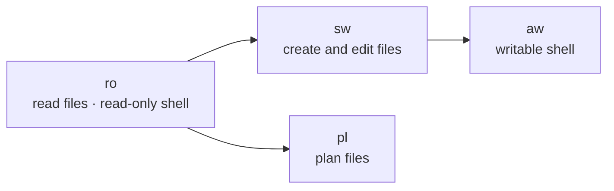
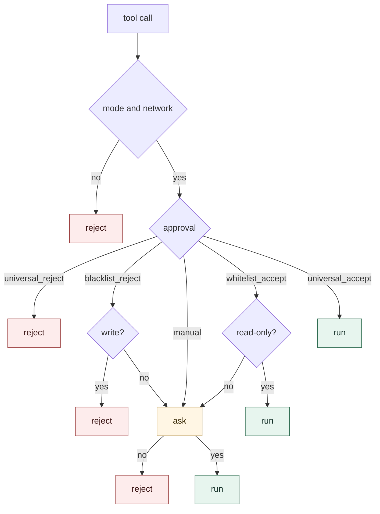
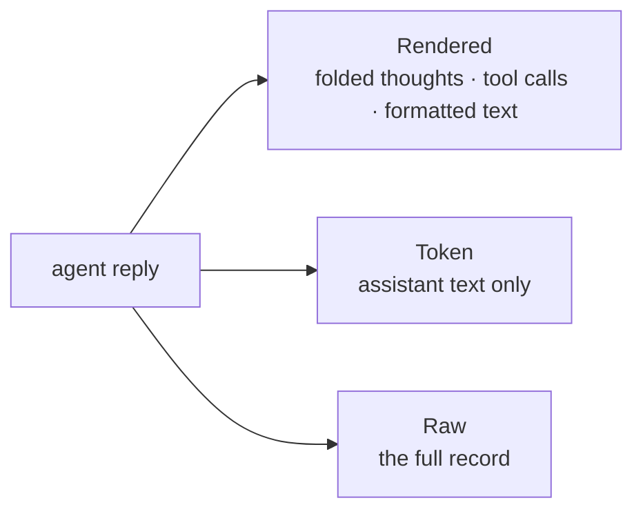
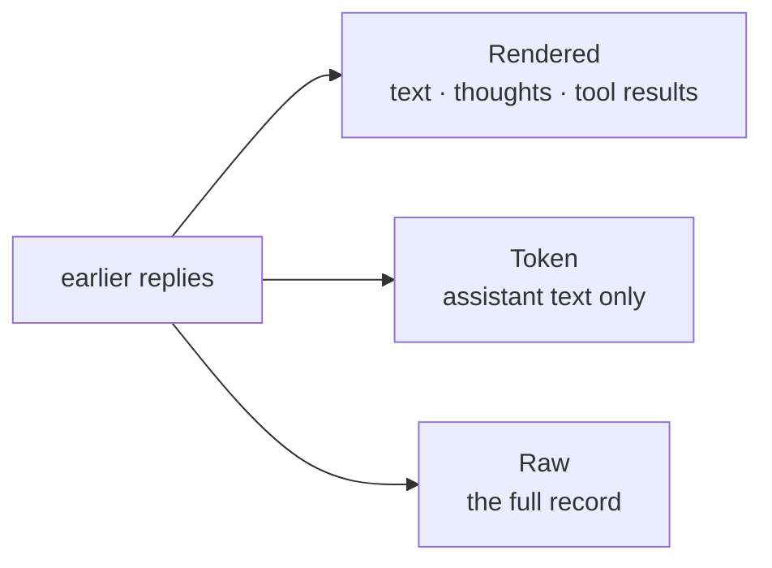
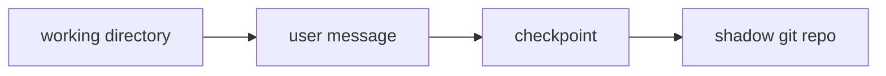

# Comonad

Comonad is a SillyTavern server plugin and UI extension: SillyTavern assembles the prompt from presets, world info, character cards, and personas, and Comonad takes that finished prompt and runs the graph the user defines. It is built on [Cordis](https://github.com/cordiverse/cordis).

## Install

Node.js 22 or newer.

```sh
shell_script/install_to_st.sh /path/to/SillyTavern
```
Restart SillyTavern yourself after it finishes.

Comonad uses the OpenAI-compatible connection selected in SillyTavern, including its saved key and sampling settings.

## Uninstall

```sh
shell_script/uninstall_from_st.sh /path/to/SillyTavern
```

## Features

### Work mode

`sw` and `aw` extend `ro`. `pl` keeps those read-only tools and adds plan files. Workspace tools need a working directory.



### Approval policy

A call the mode or the network forbids is rejected before this choice. Shell commands run under `sandbox-exec` on macOS and `bwrap` on Linux.



### Display

The tabs on a message switch that reply. New chats start from the Display setting.



### Context

The send-bar control changes what this chat sends back. New chats start from the Context setting.



### Workspace

With a working directory, each user message is snapshotted before the agent runs. See [docs/checkpoint.md](docs/checkpoint.md).




## CLI

When stdin is a TTY, `npm start` builds and opens a read-eval-print loop. `npm start -- --cli` forces it. Each start writes a new session file under `data/sessions`, named `cli - <timestamp>`. Modes and approval match a chat. Credentials come from `data/settings.json` when set, otherwise `LLM_API_BASE` and `LLM_API_KEY`.

With no value, `!mode`, `!network`, and `!approval` show the current setting and the choices.

| Command | Behavior |
| --- | --- |
| `!help` | List the commands |
| `!mode` | Show or set `ro`, `sw`, `aw`, or `pl` |
| `!network` | Show or set `on` or `off` |
| `!approval` | Show or set the approval policy |
| `!save` | Write the current session. With a name, copy it under that id and keep the current session |
| `!load` | List sessions. With an id, continue that chat |
| `!exit` | Leave |

```bash
npm start

comonad  model=deepseek-v4-pro  mode=ro  network=off  approval=manual
session  cli - 2026-09-26@11h46m52s982ms
Commands: !help !mode !network !approval !save !load !exit
> hello

Thought
The user just said "hello". This is a simple greeting. I should respond in a friendly, helpful manner. No tools needed.

Hello! How can I help you today?
> 
```
