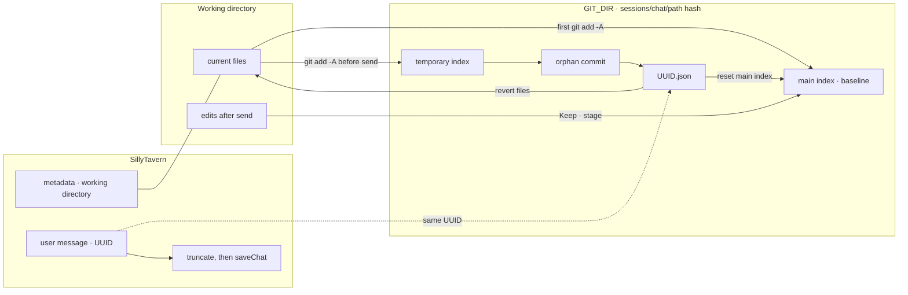

# Checkpoints

A chat bound to a working directory gets a shadow git repo. Agent edits stay in that directory for review, and can be rolled back to an earlier send.

## Two states

* **Main index.** Accepted changes. The first time a directory is bound, `git add -A` and `git commit --allow-empty` create the baseline. HEAD stays on that commit.
* **Checkpoint.** A snapshot of the whole tree taken when a user message is sent. It is an orphan commit, and its tree hash is stored in `comonad-checkpoints/<UUID>.json`. It does not move the main index.

## Shadow repo

One repo per chat id and working-directory path.

* **`GIT_DIR`:** `~/.comonad/sessions/<chat>/<first 16 hex chars of the path hash>`. `COMONAD_HOME` replaces the home directory.
* **`GIT_WORK_TREE`:** the selected working directory.
* The project's own `.git` is left alone. The directory does not need to be a git repo.

## Flow

1. **Choose a directory.** The first operation creates the shadow repo and the baseline.
2. **Send.** Stamp a UUID on the user message, snapshot the tree, then start the agent. The same UUID is captured once and never overwritten.
3. **Regenerate and swipe.** Reuse that message's checkpoint. If the chat has a working directory and a checkpoint, regenerate asks first: cancel, keep the files and run, or restore the snapshot and then run. With no checkpoint it does not ask. Swipe restores, then runs. Continue neither restores nor captures again.
4. **Agent edits.** Files in the working directory change in place. Nothing is committed yet.
5. **Keep and undo.** Keep stages the selected file or hunk into the main index, and that diff disappears. Undo puts unaccepted changes back to the main index and deletes untracked files.
6. **Revert.** Revert Files resets the working directory and the main index to the checkpoint commit (`read-tree -u --reset`) and removes new files with `git clean -fd`. The chat is truncated and saved only after that restore succeeds. If the restore fails, the chat stays as it is.

